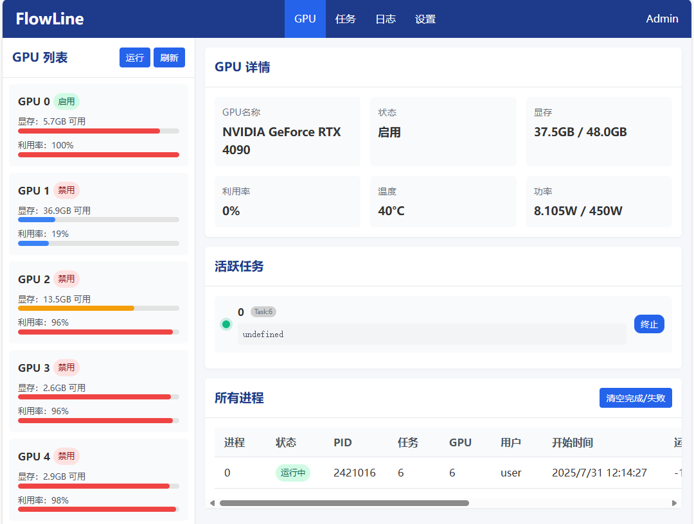
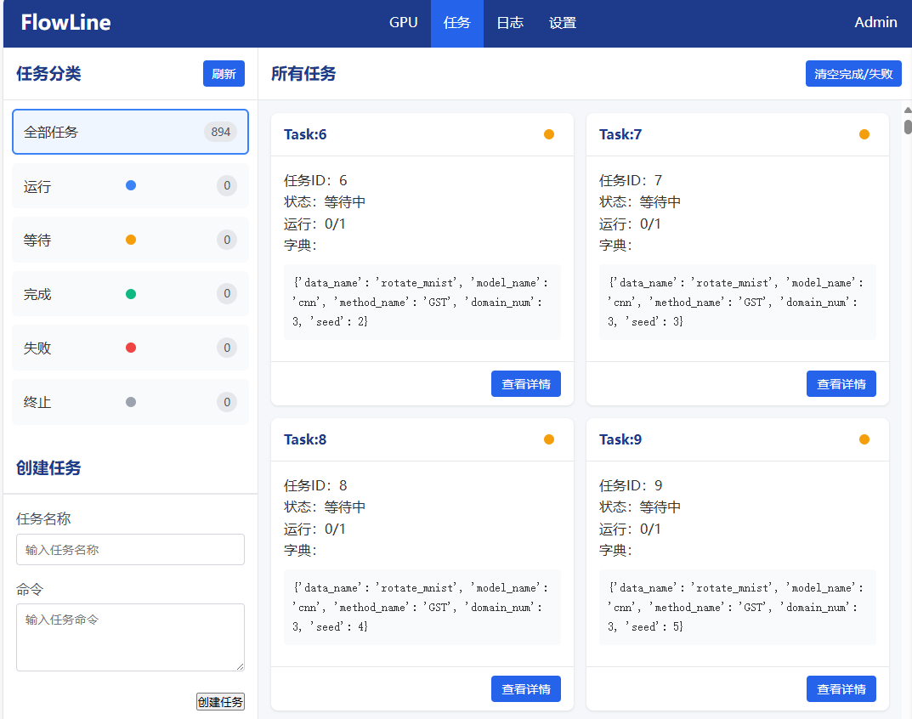
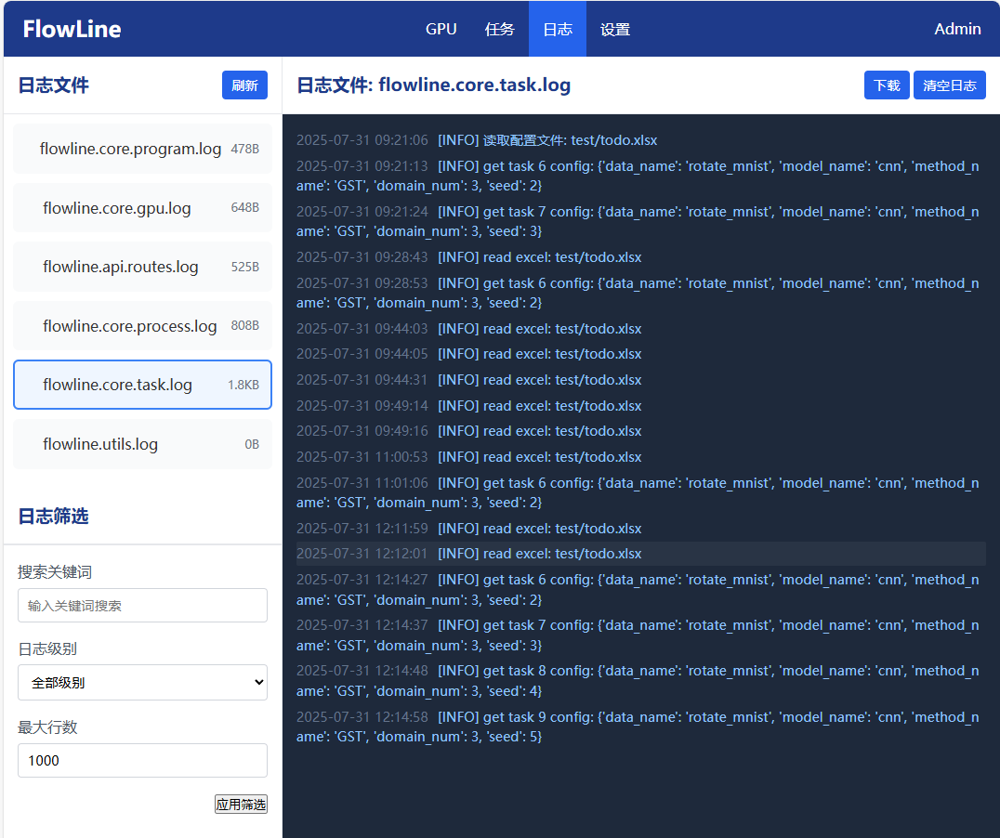
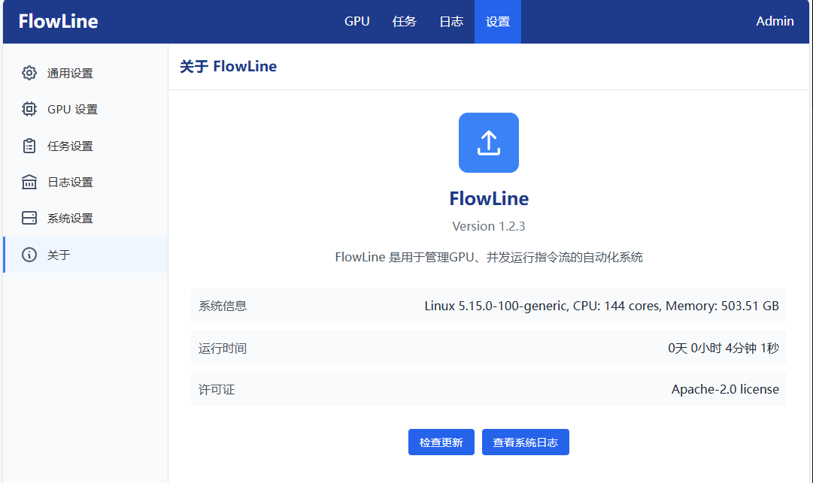

<!-- # FlowLine -->

<div align="center">
  

  <!-- [](LICENSE) -->

  中文 | [English](./docs/readme_en.md)
</div>

FlowLine 是一个用于 **GPU资源管理** 和 **并发指令流调度** 的自动化系统，支持 **命令行界面（CLI）** 和 **Web 图形界面（GUI）** 两种交互方式，适用于多任务实验、深度学习训练或高并发计算环境。

* 📘 **API 使用说明**：详见 [API文档](./docs/api.md)
* 🧩 **系统概要设计**：详见 [概要设计](./docs/design.md)
* 🏗️ **系统架构详解**：详见 [架构说明](./docs/arch.md)

该系统的设计初衷是为了替代手动监控 GPU 状态并依次执行命令的低效方式。在传统流程中，用户需要持续关注 GPU 的显存占用和利用率，还可能cuda out of memory，以便手动启动 Python 脚本或终止进程，这在多任务实验场景中尤为繁琐。本项目通过自动化机制解决了这些问题，提升了实验效率与资源利用率。

本系统的设计初衷在于替代传统的手动 GPU 监控与命令执行流程，从而提升实验效率。在传统方式下，用户需持续关注 GPU 的显存占用与利用率，并可能因 CUDA 内存不足（CUDA Out of Memory）而中断任务，需要手动启动或终止 Python 脚本。这种操作在多任务实验场景中尤为繁琐。本项目通过自动化管理机制，提升了实验效率与资源利用率。

## 核心特性

* 实时 GPU 状态监控：自动检测可用 GPU 数量、显存占用、进程信息等、并根据自定义优先函数排序；
* **报错自动处理**：错误中断后自动重新入队而解决 CUDA Out of Memory 等非程序BUG；
* 命令调度与资源控制：支持配置每条命令所需 GPU 数量、显存下限、最大并行数等条件；
* 动态调控机制：可手动终止或重启进程，实现任务队列灵活管理；
* 多任务并发执行：支持任务优先级队列、失败重试等策略，适用于批量实验运行；
* 双重交互入口：命令行接口适合在 Linux 服务器上进行脚本化控制与批量部署，Web 界面适合进行任务的可视化查看、状态监控与实时干预。

## Updates

* 2025.09.09: 新增用户自定义 GPU 优先级排序功能，通过 `user_cmp` 参数传入自定义排序函数，详见 [main_cli.py](./main_cli.py) 示例。

## 🚀 快速使用指南

### 🖥️ 使用命令行接口（CLI 模式）

#### 1. 安装方式

你可以将 `flowline` 文件夹拷贝到项目的根目录下直接引用，也可以通过以下方式将其安装到你的 Python 环境中：

* 从pip安装

```bash
pip install fline
```

* 或者从源代码安装

```bash
pip install -e <flowline库路径>
```

> 注：请确保你已安装 `pandas`、`psutil`、`openpyxl` 等`requirements.txt`内的基本依赖。

#### 2. 编写任务控制表

系统通过一个列表文件（`.xlsx`、 `.csv` 或 `.json` 格式）来定义任务参数，**这是所有任务的唯一输入方式**。文件中的每一行代表一个独立任务，每一列对应一个参数项，将自动映射为命令行中的 `--key value` 格式。

<details>
<summary>示例和说明</summary>

示例文件：[`test/todo.xlsx`](./test/todo.xlsx)、[`test/todo.csv`](./test/todo.csv)、[`test/todo.json`](./test/todo.json)， 可以通过运行[`test/task_builder.py`](./test/task_builder.py)示例构造程序构造。

| *name*    | lr    | batch\_size |*run\_num*|*need\_run\_num*| *cmd*       |
| --------- | ----- | ----------- | -------- | -------------- | ----------- |
| baseline1 | 0.01  | 64          | 0        | 1              | train\_main |
| baseline2 | 0.001 | 128         | 0        | 2              | train\_alt  |

字段说明：

* `run_num`：当前任务已执行次数，由系统自动维护（默认值为 `0`）。
* `need_run_num`：期望执行的总次数，系统将根据此值自动控制重复运行（默认值为 `1`）。
* `name`：任务名称，用于标识任务记录。若未指定，将自动生成为 `Task:{行号}`。
* `cmd`：保留字段，当前版本可预留为空或指定主命令（如 `train_main`），可结合 `func` 自定义逻辑使用。
* 其余字段可自由定义，系统会将这些字段作为参数传入自定义命令构造函数中。

> 注意：如果缺失上述保留字段，**系统会在加载文件时自动补全**，确保表结构合法。

任务表结构灵活，可覆盖从参数微调到复杂网格搜索的自动并发调度。

</details>

#### 3. 定义任务构造函数 和 GPU优先级比较函数（可选）

你需要自定义一个函数，用于根据 Excel 中的每一行任务参数 `dict` 以及分配的 GPU 编号 `gpu_id` 构造出最终的命令行字符串。

<details>
<summary>示例和说明</summary>

详见 [main_cli.py](./main_cli.py) 示例。主要部分如下：

```python
def func(dict, gpu_id, sorted_gpu_ids):
    print(sorted_gpu_ids)
    return "CUDA_VISIBLE_DEVICES="+str(gpu_id)+" python -u test/test.py "+ " ".join([f"--{k} {v}" for k, v in dict.items()])

def cmp(info1, info2):
    if info1.free_memory > info2.free_memory:
        return -1
    elif info1.free_memory < info2.free_memory:
        return 1
    else:
        return 0

if __name__ == "__main__":
    # run_cli(func, "test/todo.csv") 
    run_cli(func, "test/todo.csv", user_cmp=cmp) # user_cmp可选
```

* `dict` 是由 Excel 中当前任务行构造出的字典，键为列名，值为单元格内容；
* `gpu_id` 是系统动态分配的 GPU 编号，保证任务不冲突，其此刻一定满足显存空间最小限制；
* `sorted_gpu_ids`（可选）是经过优先级排序后的可用 GP U序列，为可能的多 GPU 任务适配；
* 拼接后的命令字符串将作为子进程执行，等效于直接在命令行中执行该命令。你可以根据实际情况替换为 shell 脚本、conda 环境、主命令变体等。

<details>
<summary>user_cmp 可用参数表</summary>

info1、info2其实是 [gpu.py](.flowline/core/gpu.py) 的 `GPU_info` 对象的实例，类中每个参数都可用于比较函数内，分别如下：

| 参数名             | 类型      | 含义说明                                                      |
| ------------------ | --------- | ------------------------------------------------------------- |
| `free_memory`      | int/float | GPU 当前可用显存大小（通常单位为 MB 或 GB）                   |
| `total_memory`     | int/float | GPU 总显存容量                                                |
| `utilization`      | int/float | GPU 当前使用率（百分比，0\~100）                              |
| `user_process_num` | int       | 当前用户进程数量（默认初始化为 0，可统计特定用户的 GPU 进程） |
| `all_process_num`  | int       | GPU 上运行的所有进程数量                                      |
| `time`             | float     | 记录信息更新时间的时间戳（UNIX 时间戳格式）                   |
| `name`             | str       | GPU 名称，如 "NVIDIA GeForce RTX 3090"                        |
| `temperature`      | int/float | GPU 当前温度（单位通常为摄氏度 °C）                           |
| `power`            | float     | GPU 当前功耗（单位通常为瓦特 W）                              |
| `max_power`        | float     | GPU 最大设计功耗（单位瓦特 W）                                |
</details>

<details>
<summary>关于输出和python -u</summary>

在命令中加入 `-u` 参数（即 `python -u ...`）表示以 **非缓冲模式（unbuffered mode）** 启动 Python：

* 标准输出（`stdout`）和标准错误（`stderr`）会**立即刷新**；
* 有助于实时查看运行日志，特别是在日志输出被重定向的场景；
* FlowLine 会将每个子任务的输出保存到 `log/` 目录下的文件中，文件名格式如下：

```
log/
├── 0.out    # 第 0 个任务的标准输出
├── 0.err    # 第 0 个任务的标准错误
├── 1.out
├── 1.err
...
```

因此，为确保日志能够**实时写入**这些文件，建议始终在命令中加入 `-u` 参数。
</details>
</details>

#### 4. 运行程序后输入`run`开始运行任务流

运行 `main_cli.py` 启动程序：

```bash
python main_cli.py
```

<details>
<summary>FlowLine CLI 命令参考表</summary>

| 语法 | 参数 | 功能说明 |
|------|------|----------|
| `run` | 无 | 切换任务处理循环的运行状态（启动/停止） |
| `gpu <id>` | `<id>`: GPU编号 | 切换指定GPU的可用状态（可用/不可用） |
| `killgpu <id>` | `<id>`: GPU编号 | 终止指定GPU上的所有进程 |
| `kill <id>` | `<id>`: 进程ID | 终止指定进程ID的进程 |
| `ls` | 无 | 列出所有正在运行的进程，显示进程ID、PID、任务ID、GPU ID、状态和命令 |
| `gpus` | 无 | 显示所有GPU的状态信息，包括利用率、内存使用、温度、功耗等 |
| `min <num>` | `<num>`: 内存大小(MB) | 设置进程所需的最小内存限制 |
| `max <num>` | `<num>`: 进程数量 | 设置最大并发进程数 |
| `task` | 无 | 列出待处理任务队列，显示任务ID、名称、运行次数等信息 |
| `exit` | 无 | 退出程序（等效`Ctrl+D`） |
| `help` 或 `?` | 无 | 显示帮助信息 |

<details>
<summary>命令使用示例</summary>

```bash
# 启动任务处理循环
> run

# 查看GPU状态
> gpus

# 查看运行中的进程
> ls

# 设置最大进程数为4
> max 4

# 设置最小内存要求为2048MB
> min 2048

# 禁用GPU 1
> gpu 1

# 终止GPU 0上的所有进程
> killgpu 0

# 查看待处理任务
> task

# 退出程序
> exit
```

</details>
</details>

### 🌐 使用 Web 界面（可视化任务管理）

> **无需额外配置，FlowLine 默认支持在 SSH 环境下运行**

除了命令行调用，你还可以使用 Web 前端界面对任务进行**实时监控与动态干预**。

### 1. 启动后端 API 服务

后端为 Flask 应用，运行 `main_server.py` 启动服务：

```bash
python main_server.py
```

### 2. 启动前端界面服务

使用 Python 自带 HTTP 服务器提供静态前端页面：

```bash
cd web
python -m http.server 8000
```

这将在 [http://localhost:8000](http://localhost:8000/) 启动前端服务，前端可通过 RESTful API 访问后端任务状态与控制接口。

<div align=center>
  
  
  
  
</div>

## 🛑 免责声明

本项目有着为显卡资源紧张环境（如实验室）中的用户提供**自动化检测与占用空闲 GPU 的能力**，便于快速启动任务、避免人工轮询等待。

### 📌 使用前须知

* 本项目提供的工具**不会以暴力方式强制杀掉他人任务**，也**不会绕过权限限制或系统调度机制**。
* 本脚本默认**只在用户拥有访问权限的设备上运行**，请确保遵守所在实验室或计算平台的使用规则。
* **请勿用于占用公共资源或干扰他人科研工作**，违者后果自负。

### 🚨 风险声明

使用本脚本可能带来的风险包括但不限于：

* 与他人并发调度产生冲突，影响公平使用；
* 若滥用，可能违反实验室/平台管理规定；

开发者对因使用本脚本而导致的**资源冲突、账号受限、数据丢失或任何直接间接损失**概不负责。

## 💐 贡献

欢迎大家为本模板贡献代码、修正bug或完善文档！

* 如有建议或问题，请提交Issue。
* 欢迎提交Pull Request。

> [!TIP]
> 若对您有帮助，请给这个项目点上 **Star**!

**感谢所有贡献者！**

[](https://github.com/dramwig/FlowLine/graphs/contributors)

<a href="https://www.star-history.com/#dramwig/FlowLine&Date">
 <picture>
   <source media="(prefers-color-scheme: dark)" srcset="https://api.star-history.com/svg?repos=dramwig/FlowLine&type=Date&theme=dark" />
   <source media="(prefers-color-scheme: light)" srcset="https://api.star-history.com/svg?repos=dramwig/FlowLine&type=Date" />
   
 </picture>
</a>
